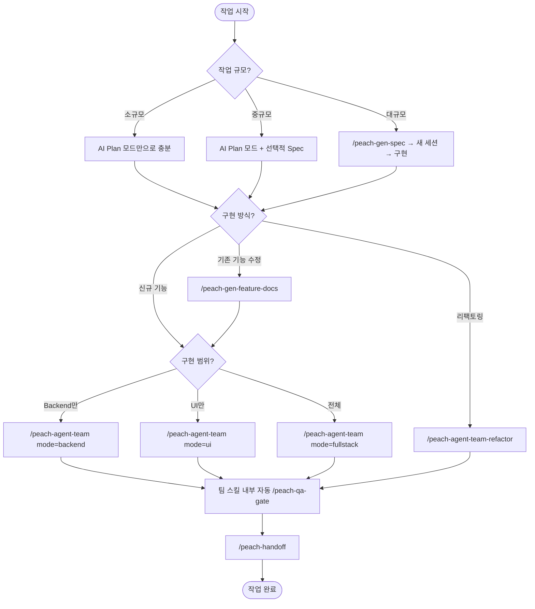

# 사용 플로우

개발자가 작업 유형에 따라 어떤 스킬을 어떤 순서로 사용하는지 안내합니다.

## 작업 규모별 워크플로우



### 소규모 작업 (1~2시간)

단일 파일 수정, 버그 수정, 간단한 기능 추가 등.

```
AI Plan 모드 → 구현 → /peach-qa-gate (선택)
```

- Spec 불필요. AI Plan 모드에서 바로 계획 수립 후 구현
- 단독 작업이면 `/peach-qa-gate` 수동 실행으로 마무리

### 중규모 작업 (반나절~1일)

새 모듈 추가, 여러 파일 수정 등.

```
AI Plan 모드 (+ 선택적 /peach-gen-spec) → /peach-gen-db → /peach-agent-team → /peach-handoff
```

- AI Plan 모드에서 계획 수립 후, 필요시 `/peach-gen-spec`으로 Spec 문서화
- 팀 스킬 사용 시 `/peach-qa-gate`는 자동 호출

### 대규모 작업 (2일 이상)

복잡한 기능, 다수 모듈 연동, 세션 분리 필요.

```
/peach-gen-spec → 새 세션 → AI Plan 모드 → /peach-gen-db → /peach-agent-team → /peach-handoff
```

- Spec 문서를 먼저 작성하고, 새 세션에서 Spec을 컨텍스트로 주입해 구현
- 세션 종료 시 `/peach-handoff`로 인수인계

## 시나리오별 상세 플로우

### 1. 신규 기능 개발

> 처음 만드는 기능. 규모에 따라 Spec 작성 여부 결정.

```
(선택) /peach-gen-spec       ← 대규모 시 Spec 문서 생성
    ↓
AI Plan 모드                  ← 구현 계획 수립
    ↓
/peach-gen-db                 ← DB 스키마 생성 (필요시)
    ↓
/peach-agent-team             ← 팀 조율 (mode=backend/ui/fullstack)
  ├── backend-dev → backend-qa (Ralph Loop)
  ├── store-dev → frontend-qa (Ralph Loop)
  └── ui-dev → frontend-qa (Ralph Loop)
    ↓
팀 스킬 내부 자동 `/peach-qa-gate`
  └── test/lint/build 증거 수집 + 잔여 리스크 판정
    ↓
/peach-handoff                ← 세션 인수인계 기록
```

### 2. 기존 기능 수정 (유지보수)

> 이미 있는 기능을 수정. 먼저 기능명세로 as-is를 파악하고, 이후 세션에서 해당 폴더를 컨텍스트로 주입해 수정 범위를 좁힌다.

```
/peach-gen-feature-docs       ← 기존 코드 분석 → as-is context pack 생성
  ├── {기능명}-1-개요.md       (진입점, 관련 파일)
  ├── {기능명}-2-로직.md       (처리 단계, 결정 이유)
  ├── {기능명}-3-명세.md       (비즈니스 결정, 데이터 매핑)
  └── {기능명}-4-TDD-가이드.md  (테스트 파일, 실행 명령)
    ↓
AI Plan 모드                  ← `docs/기능별설명/{카테고리}/{기능명}/` 전체를 컨텍스트로 주입해 수정 계획 수립
    ↓
구현                           ← 직접 수정 또는 /peach-agent-team
    ↓
직접 수정이면 `/peach-qa-gate` 수동 실행
팀 스킬이면 내부 자동 `/peach-qa-gate`
    ↓
/peach-handoff                ← 인수인계
```

### 3. 리팩토링

> 기능 변경 없이 코드 품질 개선.

```
AI Plan 모드                      ← 분석 + 계획
    ↓
/peach-agent-team-refactor        ← 팀 조율 (layer=backend/frontend/all)
  ├── refactor-backend → backend-qa (Ralph Loop)
  └── refactor-frontend → frontend-qa (Ralph Loop)
    ↓
팀 스킬 내부 자동 `/peach-qa-gate`
  └── 증거 수집 + 잔여 리스크 판정
    ↓
/peach-handoff                    ← 인수인계
```

### 4. 단일 레이어 추가 작업

> API 연동, Cron, 인쇄 페이지 등 특정 작업.

```
AI Plan 모드                  ← 분석 + 계획
    ↓
/peach-add-api                ← 외부 API 호출 코드
/peach-add-cron               ← Cron 작업
/peach-add-print              ← 인쇄 페이지
    ↓
/peach-qa-gate                ← 증거 수집
```

## 프로세스 게이트

작업의 끝을 감싸는 품질 게이트입니다.

| 게이트 | 시점 | 역할 |
|--------|------|------|
| `/peach-qa-gate` | 작업 완료 전 | test/lint/build 결과 수집, 잔여 리스크 목록. 팀 스킬에서는 자동 후속 호출, 단독 작업에서는 수동 호출 |
| `/peach-handoff` | 세션 종료 시 | 완료/미완료 사항, 결정 기록, 다음 작업 정리 |

### PR 코드리뷰 (선택)

팀 스킬 완료 후 PR을 생성하기 전, 범용 코드 품질 리뷰가 필요하면 built-in 스킬을 사용합니다:

| 스킬 | 용도 |
|------|------|
| `/requesting-code-review` | PR diff 기반 코드리뷰 요청 (자동 서브에이전트 디스패치) |
| `/receiving-code-review` | 리뷰 피드백 수신 시 기술적 검증 우선 처리 |

> PeachSolution 아키텍처 규칙 검증은 QA 에이전트 + `/peach-qa-gate`가 이미 담당하므로, built-in 코드리뷰는 **범용 코드 품질**(DRY, 에러처리, 아키텍처 등)에 집중합니다.

## 스킬 선택 빠른 참조

| 상황 | 시작 스킬 |
|------|----------|
| "어떤 스킬을 써야 할지 모르겠어" | `/peach-harness-help` |
| "새 모듈을 만들어야 해" | `/peach-gen-spec` |
| "기존 기능을 수정해야 해" | `/peach-gen-feature-docs` |
| "코드 정리가 필요해" | `/peach-agent-team-refactor` |
| "외부 API 연동해야 해" | `/peach-add-api` |
| "Cron 작업 추가해야 해" | `/peach-add-cron` |
| "인쇄 페이지 만들어야 해" | `/peach-add-print` |
| "DB 테이블 설계가 필요해" | `/peach-gen-db` |
| "디자인 시스템 정리해줘" | `/peach-gen-design` |

## 산출물 저장 구조

모든 산출물은 `docs/` 아래 통일된 구조로 저장됩니다.

```
docs/
├── spec/                    # peach-gen-spec 산출물
│   └── {년}/
│       └── {월}/
│           └── [YYMMDD]-[한글기능명].md
├── qa/                      # peach-qa-gate 산출물
│   └── {년}/
│       └── {월}/
│           └── [YYMMDD]-[한글기능명].md
└── handoff/                 # peach-handoff 산출물
    └── {년}/
        └── {월}/
            └── [YYMMDD]-[한글기능명].md
```

- 년/월 폴더가 시간순 정리를 대체 (active/completed 불필요)
- 파일 내 상태 표시로 진행 상태 판단
