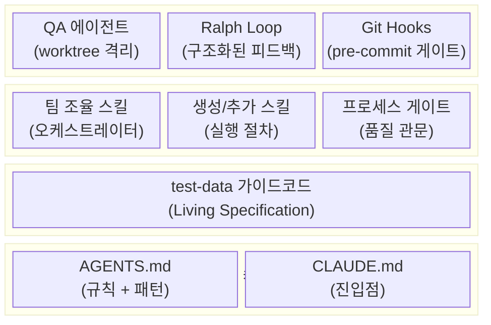
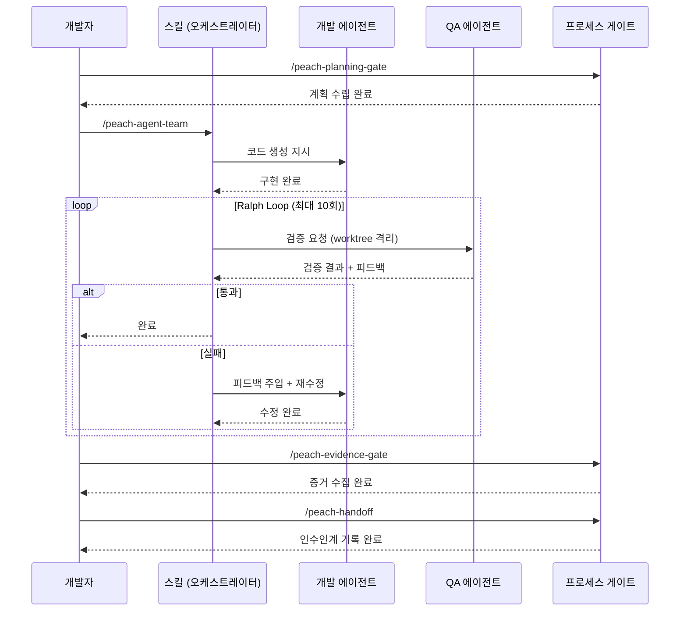
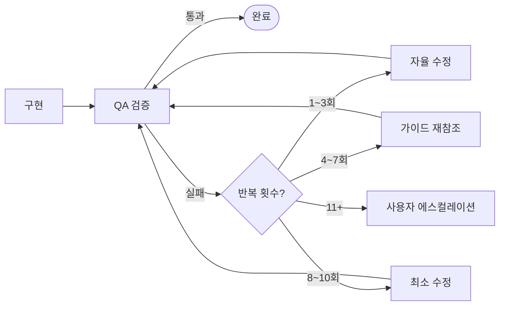
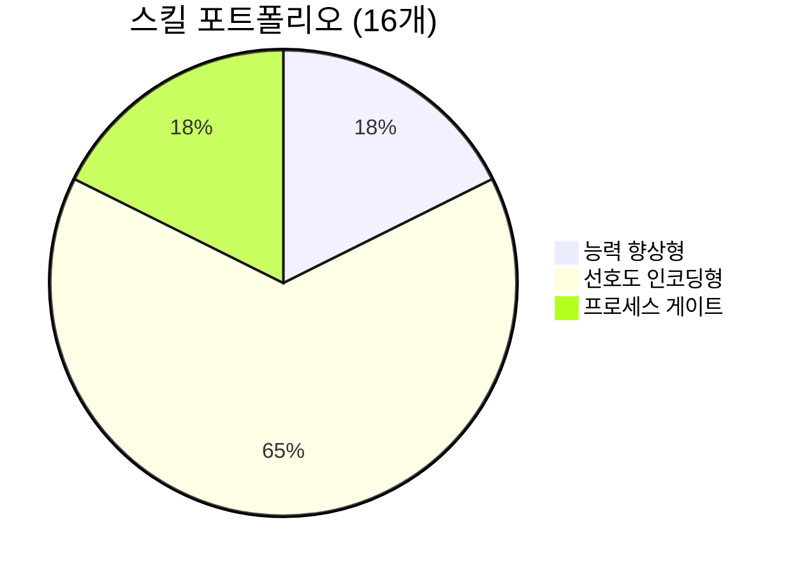

# 아키텍처

피치 하네스 시스템의 구조와 핵심 개념을 설명합니다.

## 시스템 개요

피치 하네스는 **Claude Code plugin 위에서 구동되는 AI 개발 운영 시스템**입니다.
단순 코드 생성 도구가 아니라, AI 에이전트가 신뢰할 수 있게 동작하도록 감싸는 인프라 전체입니다.

## 4계층 구조



### Layer 1: 컨텍스트 (AGENTS.md + CLAUDE.md)

AI가 지켜야 할 규칙과 프로젝트 맥락을 주입합니다.

- **공통 원칙**: 네이밍, 타입 규칙, 모듈 독립성
- **백엔드 규칙**: 프레임워크 자동 감지, Service static 메서드, DB 규칙
- **프론트엔드 규칙**: Composition API, Pinia Option API, NuxtUI 우선
- **에러 처리**: 기능오류 → HTTP 200 + `{success:false}` | 시스템예외 → `ErrorHandler`

### Layer 2: 기준 골격 (test-data)

**"Living Specification"** — 텍스트 규칙이 아니라 실제로 구동되고 검증된 코드로 기준을 강제합니다.

```
대상 프로젝트/
├── api/src/modules/test-data/    ← Backend 기준 골격
│   ├── controller/, service/, dao/, type/, test/
│   └── bun test 통과 ✅
└── front/src/modules/test-data/  ← Frontend 기준 골격
    ├── pages/, store/, type/
    └── vue-tsc + build 통과 ✅
```

코드 생성 = **기준 골격 참조** + **모듈명 치환** + **Bounded Autonomy 범위 내 보완**

### Layer 3: 스킬 시스템

스킬은 오케스트레이터 역할을 합니다. 실행 절차를 정의하고 서브에이전트를 조율합니다.

```
skills/
├── peach-agent-team/          ← 팀 조율 (mode=backend/ui/fullstack)
├── peach-agent-team-refactor/ ← 리팩토링 조율 (layer=backend/frontend/all)
├── peach-gen-backend/         ← Backend 생성 절차
├── peach-gen-store/           ← Store 생성 절차
├── peach-gen-ui/              ← UI 생성 절차
└── ...
```

### Layer 4: 검증

구현과 검증을 분리하여 품질을 보장합니다.

- **QA 에이전트**: 읽기전용 + worktree 격리 → 확증 편향 방지
- **Ralph Loop**: QA 실패 시 구조화된 피드백 주입 (단순 재시도 아님)
- **Git Hooks**: pre-commit 시점에 test/lint/build 자동 검증

## 실행 흐름



## Bounded Autonomy (제한된 자율성)

AI는 기준 골격(test-data)을 참조하되, 규칙에 따라 제한된 자율성을 가집니다.

### Must Follow (절대 준수)

AI가 변경하면 안 되는 영역입니다.

| 영역 | 규칙 |
|------|------|
| 모듈 경계 | `_common`만 import, 타 모듈 import 금지 |
| 네이밍 | snake_case(테이블), kebab-case(파일), PascalCase(클래스), camelCase(함수) |
| 타입 | 옵셔널(`?`) 금지, `null`/`undefined` 타입 금지 |
| 보안 | SQL injection, XSS, OWASP top 10 방지 |
| 에러 처리 | 기능오류 → 200+success:false, 시스템예외 → ErrorHandler |
| 검증 통과 | bun test, vue-tsc, lint, build 모두 통과 |

### May Adapt (분석 후 보완 가능)

기준 골격과 달라도 되는 영역입니다. 단, 4가지 조건을 모두 만족해야 합니다.

| 보완 가능 영역 | 예시 |
|--------------|------|
| Service 메서드 분리 | 복잡한 비즈니스 로직을 여러 메서드로 분리 |
| DAO 쿼리 구성 | 조건부 JOIN, 서브쿼리 활용 |
| Validator 배치 | 그룹 검증, 커스텀 데코레이터 |
| UI 상호작용 | 모달 대신 인라인 편집 등 |

**Adapt 조건 (4가지 모두 충족):**
1. 왜 다른 구조가 필요한지 설명 가능
2. Must Follow를 침범하지 않음
3. test/lint/build/QA 통과
4. 차이점과 이유를 세션 기록에 기록

## Ralph Loop

QA 실패 시 단순 재시도가 아닌 **구조화된 피드백 주입** 패턴입니다. (Vercel Labs)



| 횟수 | 단계 | 전략 |
|------|------|------|
| 1~3회 | 자율 수정 | QA 피드백만으로 수정 |
| 4~7회 | 가이드 재참조 | test-data 기준골격 전체 재읽기 |
| 8~10회 | 최소 수정 | Must Follow 항목만 집중 |
| 11+회 | 중단 | 사용자에게 에스컬레이션 |

## 스킬 유형 분류



| 유형 | 스킬 | 검증 방법 |
|------|------|----------|
| **능력 향상형** (3) | gen-design, gen-prd, gen-feature-docs | 새 모델 시 A/B 테스트 |
| **선호도 인코딩형** (11) | gen-backend, gen-db, gen-store, gen-ui, add-api, add-cron, add-print, refactor-backend, refactor-frontend, agent-team, agent-team-refactor | Eval 충실도 검증 |
| **프로세스 게이트** (3) | planning-gate, evidence-gate, handoff | 워크플로우 품질 게이트 |

## 바이브코딩 vs 하네스 시스템

| 항목 | 바이브코딩 | 하네스 시스템 |
|------|----------|------------|
| 전제 조건 | 높은 이해도 필요 | 이해도 수준 무관 |
| 패턴 일관성 | 약함 | 강함 (test-data 기준) |
| 팀 개발 | 어려움 | 용이 (AGENTS.md + 스킬) |
| 코드 품질 | 담당자 의존 | TDD + lint + build 강제 |
| 보안 검증 | 약함 | 강함 (QA 체크리스트) |
| 문서 자산화 | 약함 | 강함 (SKILL.md + handoff) |
