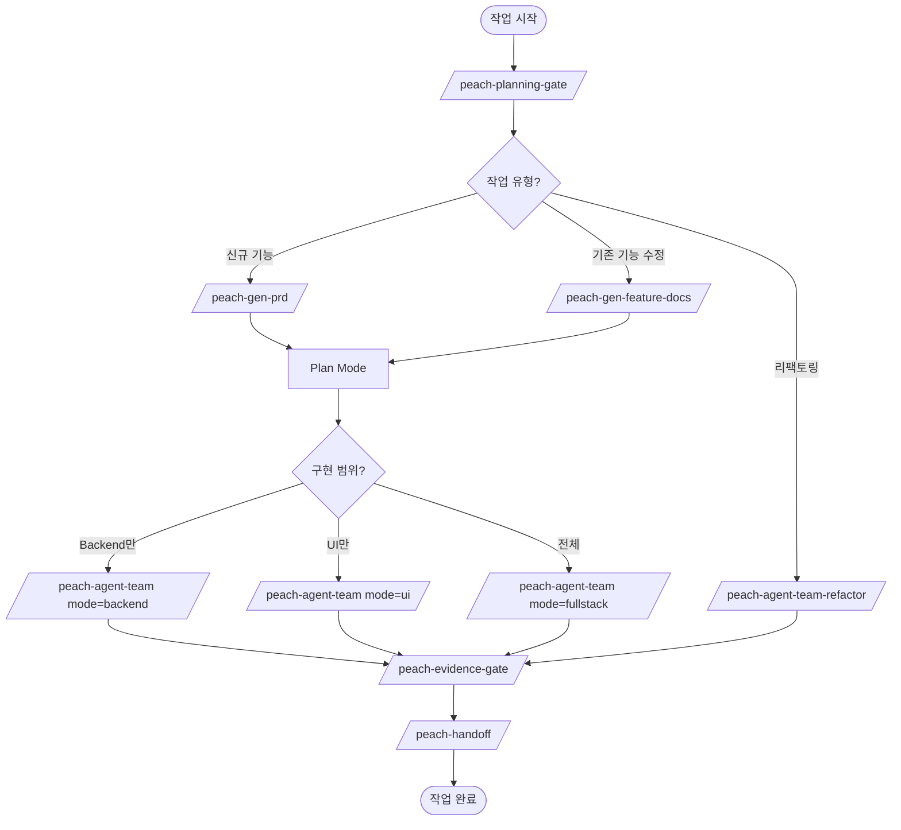

# 사용 플로우

개발자가 작업 유형에 따라 어떤 스킬을 어떤 순서로 사용하는지 안내합니다.

## 작업 유형별 스킬 선택



## 시나리오별 상세 플로우

### 1. 신규 기능 개발

> 처음 만드는 기능. PRD부터 시작.

```
/peach-planning-gate          ← 작업 유형 분류 + 분석
    ↓
/peach-gen-prd                ← 요구사항 수집 → PRD 문서 생성
    ↓
Plan Mode                     ← 구현 계획 수립
    ↓
/peach-gen-db                 ← DB 스키마 생성 (필요시)
    ↓
/peach-agent-team             ← 팀 조율 (mode=backend/ui/fullstack)
  ├── backend-dev → backend-qa (Ralph Loop)
  ├── store-dev → frontend-qa (Ralph Loop)
  └── ui-dev → frontend-qa (Ralph Loop)
    ↓
/peach-evidence-gate          ← test/lint/build 증거 수집
    ↓
/peach-handoff                ← 세션 인수인계 기록
```

### 2. 기존 기능 수정 (유지보수)

> 이미 있는 기능을 수정. 먼저 기능명세로 as-is를 파악.

```
/peach-planning-gate          ← 작업 유형 분류 + 분석
    ↓
/peach-gen-feature-docs       ← 기존 코드 분석 → 4개 문서 생성
  ├── {기능명}-1-개요.md       (진입점, 관련 파일)
  ├── {기능명}-2-로직.md       (처리 단계, 결정 이유)
  ├── {기능명}-3-명세.md       (비즈니스 결정, 데이터 매핑)
  └── {기능명}-4-TDD-가이드.md  (테스트 파일, 실행 명령)
    ↓
Plan Mode                     ← 수정 계획 수립 (as-is 기반)
    ↓
구현                           ← 직접 수정 또는 /peach-agent-team
    ↓
/peach-evidence-gate          ← 증거 수집
    ↓
/peach-handoff                ← 인수인계
```

### 3. 리팩토링

> 기능 변경 없이 코드 품질 개선.

```
/peach-planning-gate              ← 분석 + 계획
    ↓
/peach-agent-team-refactor        ← 팀 조율 (layer=backend/frontend/all)
  ├── refactor-backend → backend-qa (Ralph Loop)
  └── refactor-frontend → frontend-qa (Ralph Loop)
    ↓
/peach-evidence-gate              ← 증거 수집
    ↓
/peach-handoff                    ← 인수인계
```

### 4. 단일 레이어 추가 작업

> API 연동, Cron, 인쇄 페이지 등 특정 작업.

```
/peach-planning-gate          ← 분석 + 계획
    ↓
/peach-add-api                ← 외부 API 호출 코드
/peach-add-cron               ← Cron 작업
/peach-add-print              ← 인쇄 페이지
    ↓
/peach-evidence-gate          ← 증거 수집
```

## 프로세스 게이트

모든 플로우의 시작과 끝을 감싸는 품질 게이트입니다.

| 게이트 | 시점 | 역할 |
|--------|------|------|
| `/peach-planning-gate` | 작업 시작 전 | 유형 분류, 관련 코드 분석, 계획 문서 작성 |
| `/peach-evidence-gate` | 작업 완료 전 | test/lint/build 결과 수집, 잔여 리스크 목록 |
| `/peach-handoff` | 세션 종료 시 | 완료/미완료 사항, 결정 기록, 다음 작업 정리 |

## 스킬 선택 빠른 참조

| 상황 | 시작 스킬 |
|------|----------|
| "새 모듈을 만들어야 해" | `/peach-gen-prd` |
| "기존 기능을 수정해야 해" | `/peach-gen-feature-docs` |
| "코드 정리가 필요해" | `/peach-agent-team-refactor` |
| "외부 API 연동해야 해" | `/peach-add-api` |
| "Cron 작업 추가해야 해" | `/peach-add-cron` |
| "인쇄 페이지 만들어야 해" | `/peach-add-print` |
| "DB 테이블 설계가 필요해" | `/peach-gen-db` |
| "디자인 시스템 정리해줘" | `/peach-gen-design` |
