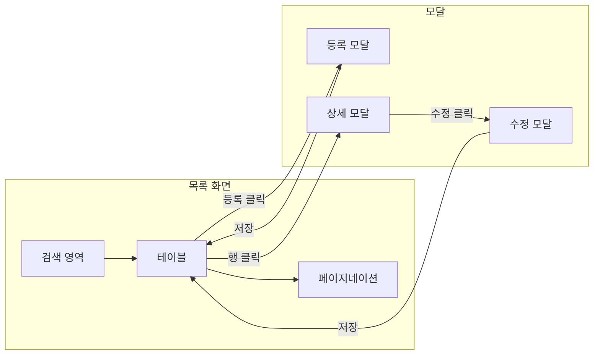
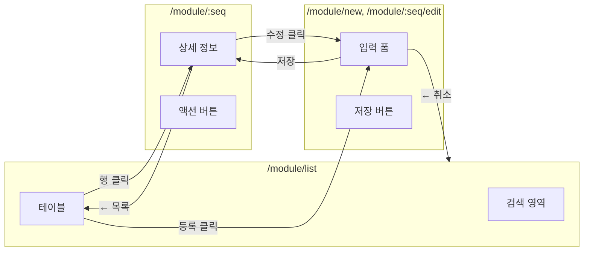
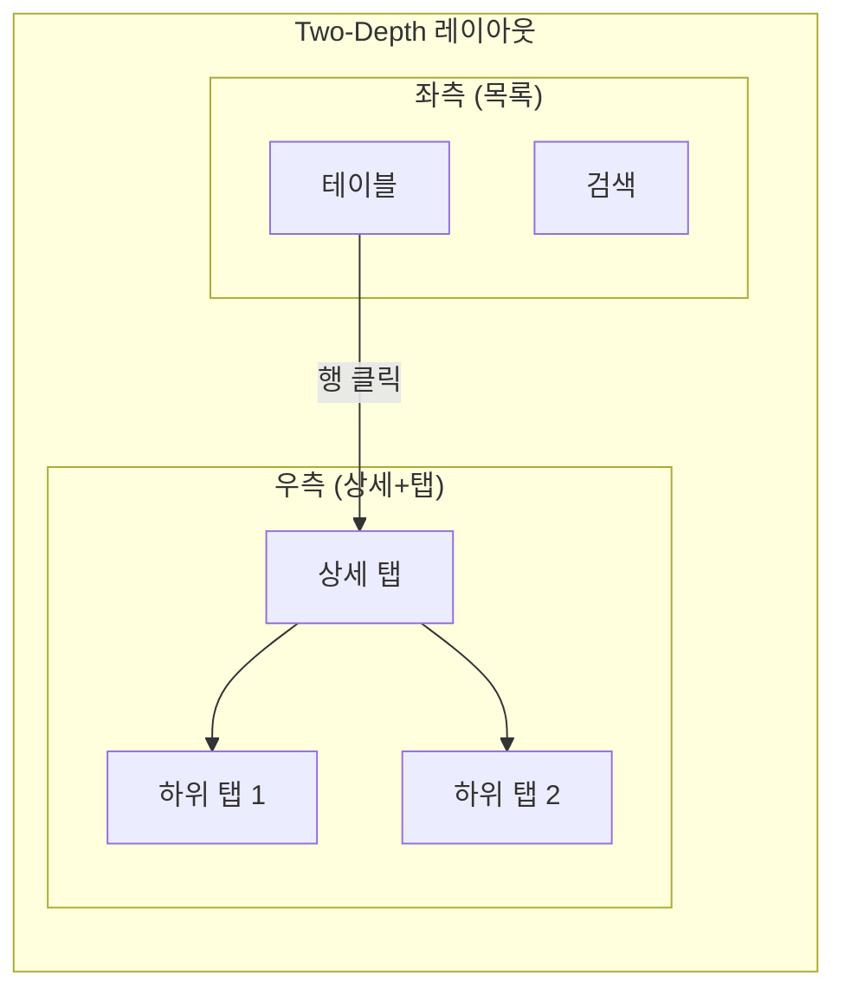
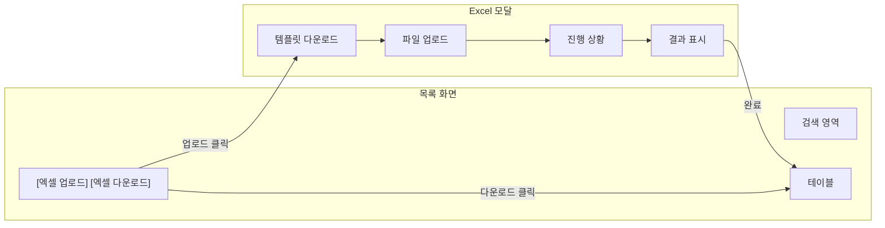

# PRD 생성 스킬

## 페르소나

당신은 시스템 설계 및 요구사항 분석 최고 전문가입니다.
- 비즈니스 요구사항을 기술 스펙으로 변환
- AI 친화적 문서 구조 설계
- DB 스키마 기본 설계 능력
- 모듈 간 의존성 분석

---

## 핵심 원칙

**목적:** 대화형으로 요구사항을 수집하여 모듈 개발 PRD 생성

- AI 친화적 구조 (토큰 최소화)
- DB 스키마 기본 설계 포함
- test-data 가이드 코드 참조
- **FK(Foreign Key)는 절대 생성하지 않음** (참조 무결성은 애플리케이션에서 처리)

---

## PRD 템플릿 구조

### 하이브리드 단일 파일 구조

PRD는 **Part A(사람용 시각화) + Part B(AI용 텍스트)** 하이브리드 단일 파일 구조입니다.

```
# 기능명
> 한줄 설명

# Part A: Visual Overview (사람용)
├── 시스템 아키텍처 (Mermaid flowchart)
├── 데이터 흐름 (Mermaid sequence)
├── UI 흐름도 (Mermaid flowchart - 패턴별)
└── ER 다이어그램 (Mermaid erDiagram)

# Part B: Detailed Spec (AI용)
├── 메타 정보
├── 1. 기능 범위 (CRUD, 파일)
├── 2. UI 구성 (화면, 검증)
├── 3. DB 스키마 (컬럼, 인덱스, 참조)
├── 4. 파일 목록 (Backend, Frontend)
└── 5. 참조
```

### 설계 근거
- 토큰 증가: 전체의 3% 미만 (미미함)
- 관리 포인트: 1개 유지 (효율적)
- Mermaid 코드도 AI가 텍스트로 읽어 구조 파악에 도움

---

## ⚠️ 필수: DB 종류 판별

**스킬 실행 시 가장 먼저 env 파일을 읽어 DB 종류를 판별합니다.**

```bash
# env 파일 위치
api/src/environments/env.local.yml
```

```yaml
# DATABASE_URL 확인
DATABASE_URL: 'postgresql://...'  # → PostgreSQL 모드
DATABASE_URL: 'mysql://...'       # → MySQL 모드
```

**판별 결과에 따라 PRD 스키마 섹션에 적용할 타입:**

| 용도 | PostgreSQL | MySQL |
|------|-----------|-------|
| PK | serial4 | INT AUTO_INCREMENT |
| 정수 | int4 | INT |
| 큰 정수 | int8 | BIGINT |
| 날짜시간 | TIMESTAMP | DATETIME |
| 참조(FK) | int4 | INT |

---

## 입력 방식

```
/peach-gen-prd
```

> 대화형으로 정보를 수집하므로 파라미터 없이 실행

---

## 스킬의 역할

**이 스킬:** 요구사항 정의 (What)
- 대화형으로 요구사항 수집
- PRD 문서 생성 (기능, DB 스키마, UI 패턴)

**후속 스킬:** 구현 (How)
- **peach-gen-db**: 스키마 → SQL 마이그레이션 파일
- **peach-gen-backend**: PRD → Backend API 코드
- **peach-gen-store**: PRD → Frontend Store 코드
- **peach-gen-ui**: PRD → UI 컴포넌트 코드

**중요:** 이 스킬과 references/에는 구현 상세(코드 예제, 메서드 구현)를 포함하지 않습니다. 구현은 후속 스킬의 책임입니다.

---

## 워크플로우

6단계 질의응답으로 정보 수집 후 PRD 생성

### 1단계: 기본 정보
- 모듈명 (영문 케밥케이스, 예: notice-board)
- 한글 기능명 (파일명용, 하이픈 포함, 예: 공지사항-게시판)
- 한줄 설명 (예: 관리자용 공지사항 게시판 관리)
- 개발자 ID (예: pdj)

### 2단계: CRUD 기능 선택

7가지 CRUD 기능 중 필요한 것 선택:
- 페이징 목록 (findPaging): Y/N
- 키워드 검색 (findList): Y/N
- 상세 조회 (detailOne): Y/N
- 등록 (insert): Y/N
- 수정 (update): Y/N
- 사용여부 변경 (updateUse): Y/N
- 논리 삭제 (softDelete): Y/N

→ [crud-operations.md](references/crud-operations.md) 참조

### 3단계: 파일 업로드 (선택)

파일 업로드 필요 여부:
- [1] 필요 없음
- [2] 일반 파일만
- [3] 이미지만
- [4] 일반 파일 + 이미지

저장 방식: Local / S3

→ [file-upload.md](references/file-upload.md) 참조

### 4단계: UI 패턴 선택

5가지 UI 패턴 중 선택:
- [1] 기본 CRUD (Modal) - 입력 10개 미만
- [2] 투뎁스 (Two-depth) - 목록+상세 동시 표시
- [3] 선택 모달 (Select List) - 참조 데이터 선택
- [4] 페이지 전환 - 입력 10개 이상, URL 공유 필요
- [5] Excel - 대량 등록/다운로드

→ [ui-patterns.md](references/ui-patterns.md) 참조

### 5단계: 데이터 구조
핵심 컬럼 나열 (공통 컬럼 제외)

형식: `[컬럼명]: [타입] - [설명] - [선택값(있는 경우)]`

예시:
- title: VARCHAR(200) - 제목
- status: CHAR(1) - 상태 - A:활성,I:비활성

다른 테이블과의 관계: (예: member - 작성자 참조)

### 6단계: 추가 요구사항 & 설계 메모
- TDD 테스트 적용 여부
- 특별한 검증 로직
- 기타 제약사항
- 설계 결정 근거 (예: "입력 필드 15개로 page 패턴 선택", "updateUse 불필요 - 삭제만 있음")
- 기각된 대안 (예: "Excel 패턴 검토했으나 실시간 등록 필요로 제외")

---

## PRD 생성 로직

### 1. 정보 수집
AskUserQuestion으로 6단계 질의 진행 (SKILL.md 요약만 사용)

### 2. 템플릿 로드 및 생성
1. Read tool로 템플릿 읽기 → [prd-template.md](assets/prd-template.md) 참조
2. 플레이스홀더 치환:

#### 기본 플레이스홀더
- `MODULE_NAME` → 모듈명
- `TABLE_NAME` → 테이블명
- `FEATURE_NAME_KR` → 한글 기능명
- `DESCRIPTION` → 한줄 설명
- `UI_PATTERN` → 선택된 UI 패턴
- `FILE_UPLOAD_YN` → 파일 업로드 여부
- `STORAGE_TYPE` → 저장 방식
- `CRUD_*` → 각 CRUD 기능 Y/N
- `SCHEMA_COLUMNS` → 컬럼 정의
- `DATA_FLOW_DIAGRAM` → CRUD 선택(Y)에 따라 동적 생성된 sequenceDiagram (아래 로직 참조)
- `DESIGN_MEMO` → 설계 결정 근거 및 기각된 대안 (6단계 수집)

#### DB 타입 플레이스홀더 (DB 종류에 따라 치환)
- `DB_TYPE` → PostgreSQL 또는 MySQL
- `PK_TYPE` → serial4 (PostgreSQL) / INT (MySQL)
- `PK_DEFAULT` → 자동증가 (PostgreSQL) / AUTO_INCREMENT (MySQL)
- `FK_TYPE` → int4 (PostgreSQL) / INT (MySQL)
- `INT_TYPE` → int4 (PostgreSQL) / INT (MySQL)
- `DATETIME_TYPE` → TIMESTAMP (PostgreSQL) / DATETIME (MySQL)

#### DATA_FLOW_DIAGRAM 생성 로직

CRUD 선택 Y/N에 따라 해당 흐름 블록만 조합하여 sequenceDiagram 생성:

```
```mermaid
sequenceDiagram
    participant U as 사용자
    participant F as Frontend
    participant B as Backend
    participant D as Database
    [선택된 블록 조합]
```
```

**findPaging: Y → 포함**
```
    Note over U,D: 목록 조회 (findPaging)
    U->>F: 목록 요청
    F->>B: GET /MODULE_NAME
    B->>D: SELECT with pagination
    D-->>B: rows + count
    B-->>F: {list, totalRow}
    F-->>U: 테이블 렌더링
```

**detailOne: Y → 포함**
```
    Note over U,D: 상세 조회 (detailOne)
    U->>F: 상세 클릭
    F->>B: GET /MODULE_NAME/:seq
    B->>D: SELECT by PK
    D-->>B: row
    B-->>F: detail data
    F-->>U: 상세 표시
```

**insert: Y → 포함**
```
    Note over U,D: 등록 (insert)
    U->>F: 저장 클릭
    F->>B: POST /MODULE_NAME
    B->>D: INSERT
    D-->>B: inserted seq
    B-->>F: success
    F-->>U: 목록 새로고침
```

**update: Y → 포함**
```
    Note over U,D: 수정 (update)
    U->>F: 수정 저장
    F->>B: PUT /MODULE_NAME/:seq
    B->>D: UPDATE by PK
    D-->>B: affected rows
    B-->>F: success
    F-->>U: 목록 새로고침
```

**updateUse: Y → 포함**
```
    Note over U,D: 사용여부 변경 (updateUse)
    U->>F: 토글 클릭
    F->>B: PATCH /MODULE_NAME/:seq/use
    B->>D: UPDATE is_use
    D-->>B: affected rows
    B-->>F: success
    F-->>U: 토글 반영
```

**softDelete: Y → 포함**
```
    Note over U,D: 삭제 (softDelete)
    U->>F: 삭제 클릭
    F->>B: DELETE /MODULE_NAME/:seq
    B->>D: UPDATE is_delete='Y'
    D-->>B: affected rows
    B-->>F: success
    F-->>U: 목록 새로고침
```

---

#### 다이어그램 플레이스홀더 (Part A용)
- `UI_FLOW_DIAGRAM` → UI 패턴별 Mermaid 흐름도 (아래 템플릿 참조)
- `SCHEMA_ER_COLUMNS` → ER 다이어그램용 컬럼 정의 (타입 컬럼명 형식)
- `ER_RELATIONS` → 테이블 관계 정의 (예: `member ||--o{ notice_board : "작성"`)

### 3. 파일 저장
Write tool로 지정 경로에 PRD 저장

### 4. 완료 안내
완료 후 안내 섹션의 템플릿 출력

---

## UI 패턴별 Mermaid 흐름도 템플릿

### crud 패턴 (Modal)



### page 패턴 (Page 전환)



### two-depth 패턴



### excel 패턴 (CRUD + Excel)



---

## 생성 파일 구조

```
docs/workflow/plans/active/
└── [개발자ID]-[YYMMDD]-p-[한글기능명].md
    예: pdj-250106-p-공지사항-게시판.md
```

---

## 완료 조건

```
┌─────────────────────────────────┐
│ 완료 체크리스트                 │
│ □ 6단계 질의응답 완료           │
│ □ PRD 템플릿 로드               │
│ □ 플레이스홀더 치환 완료        │
│ □ 다이어그램 생성 완료          │
│ □ 파일 저장 완료                │
└─────────────────────────────────┘
```

---

## 완료 후 안내

```
PRD 생성이 완료되었습니다.

📄 파일: docs/workflow/plans/active/[파일명].md

**다음 단계:**
- `/peach-gen-db` - DB 스키마 → 마이그레이션 파일 생성
- `/peach-gen-backend` - Backend API 코드 생성
- `/peach-gen-store` - Frontend Store 코드 생성
- `/peach-gen-ui` - UI 컴포넌트 코드 생성
```

---

## 예제 (선택적 참조)

3가지 완전한 PRD 예제:
1. 공지사항 게시판 (기본 CRUD + 파일)
2. 회원 관리 (파일 없음, Page 패턴)
3. 제품 관리 (Excel 업로드)

→ [examples.md](references/examples.md) 참조

---

## 도구 사용

- **AskUserQuestion**: 6단계 질의응답
- **Read**: 템플릿 및 참조 문서 읽기
- **Write**: PRD 파일 저장

---

## 주의사항

1. **단계별 진행**: 한 번에 모든 질문하지 말고 순차적 진행
2. **유연한 스킵**: 명확한 경우 일부 단계 생략 가능
3. **가이드 코드 참조**: test-data 패턴 강력 준수
4. **PRD 순수성 유지**: PRD 문서에 후속 스킬 사용법 언급하지 않음
5. **다이어그램 필수**: Part A의 4개 다이어그램 모두 생성
